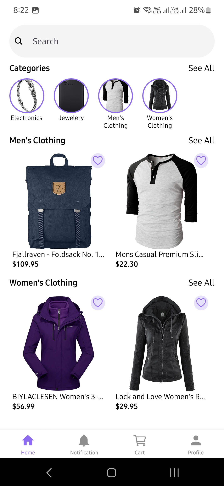
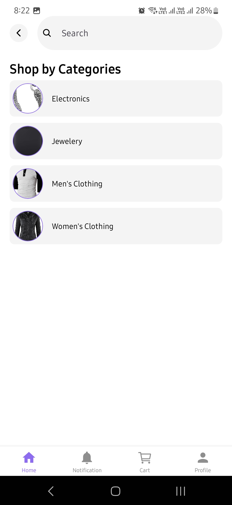
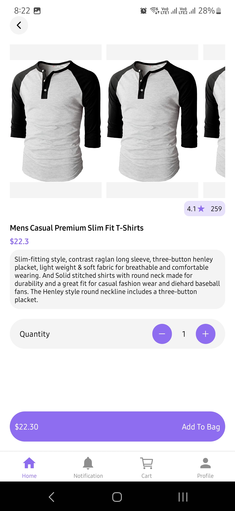
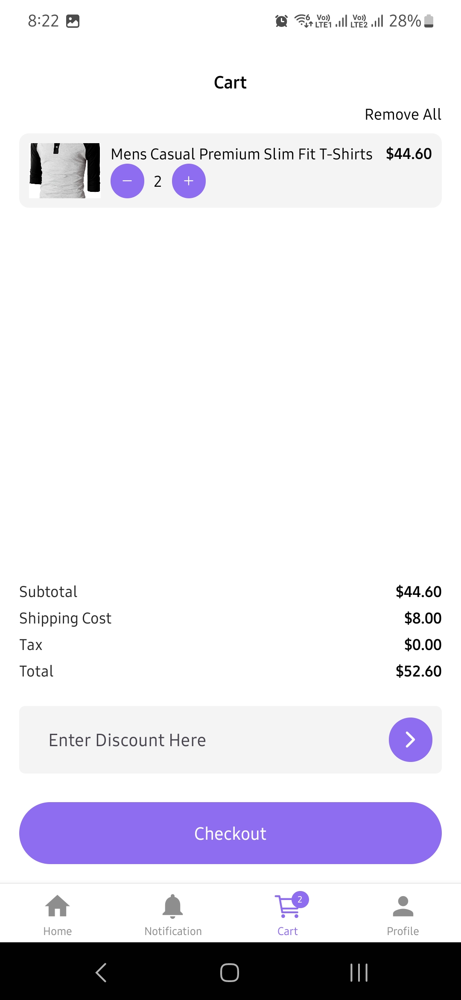

# Ecommerce App

An ecommerce app built using React Native.

## Features

- Uses fakestoreapi for product catalog
- Add/remove products to/from favorites
- Add/remove products from cart
- Login using email and password
- Uses context to store login, favorite and cart data

## Screenshots

 
   
   
 
   

